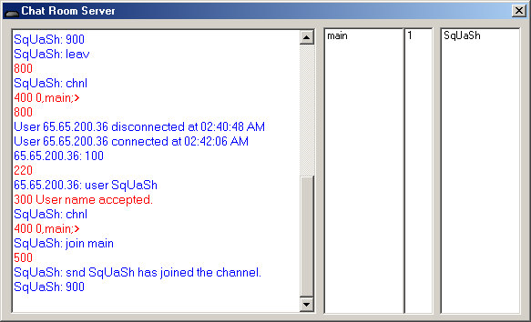



## Multiple Room Chat with Server and Client

### Description

Start up a server or connect to the default server with the client, choose a chat room and start chatting. You can join another chat room by exiting your current one and joining another on the list. You can also password protect rooms that you create. Vote for me :)
 
### More Info
 
you need to have the inet ocx to use the client...if you dont have it you can download it at http://www.hayesproductionsinc.com/downloads/MSINET.OCX

             |
---                |---
**Submitted On**   |2001-04-15 02:15:26
**By**             |[Daniel Errante](https://github.com/Planet-Source-Code/PSCIndex/blob/master/ByAuthor/daniel-errante.md)
**Level**          |Advanced
**User Rating**    |3.7 (11 globes from 3 users)
**Compatibility**  |VB 6\.0
**Category**       |[Internet/ HTML](https://github.com/Planet-Source-Code/PSCIndex/blob/master/ByCategory/internet-html__1-34.md)
**World**          |[Visual Basic](https://github.com/Planet-Source-Code/PSCIndex/blob/master/ByWorld/visual-basic.md)
**Archive File**   |[Multiple R184024152001\.zip](https://github.com/Planet-Source-Code/daniel-errante-multiple-room-chat-with-server-and-client__1-22420/archive/master.zip)

